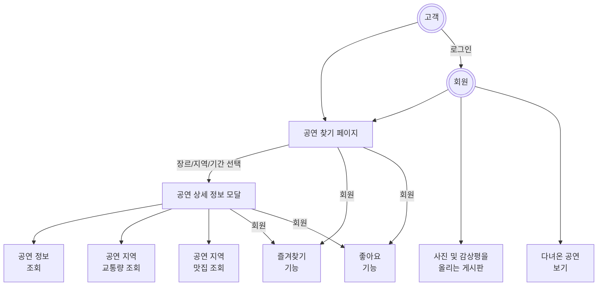

# STAVAGE: 공연/전시 정보 웹 어플리케이션

## Info

- 공공데이터 포털 Open API를 이용한 공연/전시 정보 알림이 반응형 웹 어플리케이션
  - [한국문화정보원\_공연전시정보조회서비스](https://www.data.go.kr/data/15000120/openapi.do?recommendDataYn=Y#)
- 날짜, 지역에 따른 공연 목록 출력
- 라인업 가수들 정보까지 출력

## Use Case


## Tech Used

###

**[UI/UX]**

- Figma
- Photoshop

**[Front-end]**

- Next.js 13
- Tailwind CSS

**[Distribution]**

- Docker
- Jenkins
- AWS, NCP (Niginx)

## Getting Started

First, run the development server:

```bash
npm run dev
```

## Directory Architecture

### app
- app은 Next.js 13 버전부터 지원되는 디렉토리이다.
- app의 디렉토리 구조는 라우팅 구조와 같다.
- Next.js 13은 흥미로운 루트 컴포넌트를 지원하는데 다음과 같다.
  - layout.tsx: 전체 애플리케이션을 래핑하는 특별한 레이아웃이다.
  - loading.tsx: 전체 라우트의 Suspense 바운더리를 정의할 수 있다.
  - error.tsx: 전체 라우트의 에러 바운더리를 정의할 수 있다.
  - 레이아웃과 유사하지만, 모든 페이지 이동시 다시 렌더링한다. 인/아웃 트랜지션과 같은 경로 간 상태를 처리하는데 특히 유용하다.
- app 폴더 내부에 api 폴더를 생성하여 서버 기능을 구현할 수 있다. 다만 Open API 프로젝트에서는 자체 API를 만들 일은 별로 없다.

### assets

- 동적인 이미지 파일을 사용하기 위해서 binary data를 사용할 경우 여기에 저장한다.
- lottie와 같은 라이브러리를 이용할 때, 사이트에서 받은 json 파일을 저장하면 된다.

### components
- 컴포넌트들은 PascalCase로 작성한다.
- 컴포넌트들은 Hoisting을 고려하여 선언형으로 작성한다.

### hooks

- Custom Hook은 이 디렉토리에 저장한다.
- naming convention은 camelCase로 작성하도록 한다.

### utils

- 유용한 함수들을 저장하는 디렉토리이다.
- naming convention은 camelCase로 작성하도록 한다.

## Code Convention
- 모든 컴포넌트와 함수는 함수형으로 작성한다.
- export default는 함수 선언부에서 작성한다.
- 컴포넌트는 Hoisting을 고려하여 선언형으로 작성한다. 아래는 예시.
``` tsx
export default function Home(){

	return ...
}

```

- 함수는 화살표 함수로 작성한다. 아래는 예시.
``` ts
const Home = () => {
	...
}

export default Home();
```

## Git Convention

- 제목은 다음과 같이 영어로 작성

```bash
[Type] details...
```

- 내용은 그냥 한국어로 대충 설명

- Type은 다음과 같다.

[Feat]: 기능 추가

[Fix]: 자잘한 버그 수정

[Style]: 코드 포맷팅

[Refactor]: 코드 리팩토링

[Docs]: 문서 수정

[Test]: 테스트 코드

[Chore]: 빌드 업무 수정, 패키지 매니저 수정

## Reference
- https://dive.hyundaicard.com/web/superconcert/spaceMain.hdc
- https://ticket.interpark.com/